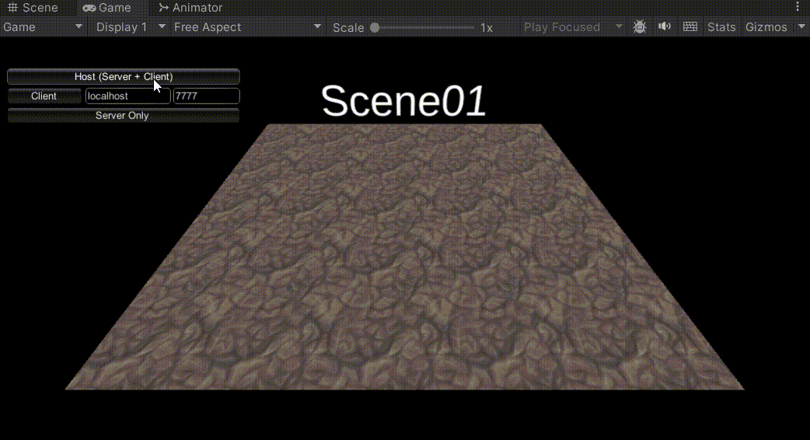
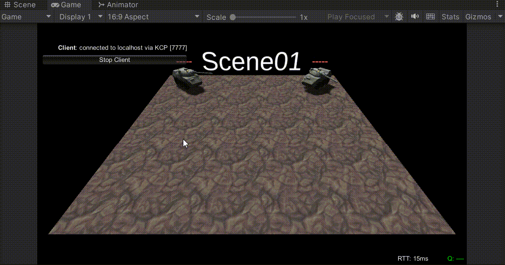

# MirrorAddressablesDemo
A demo project that added Addressables Scene Management support to Mirror Networking.

by Shepherd Zhu

## Features
- Change scenes from Addressables across the server.

## Showcase
- Host/Server side


- Client side



## TODO
- Support og's onlineScene and offlineScene.

## Dependencies
- Addressables
- Mirror Networking (Demo project is using v90. But it should be good with compatibility as long as no major API change presents. )
- ParrelSync (Not required. Demo project is using this to test without building. )

## Message from the author
It's sad that Mirror's Scene Management does not support Addressables. I have been googling a solution for a while and nothing useful. 

Someone from [Reddit](https://www.reddit.com/r/Unity3D/comments/vmwayb/change_to_an_addressable_scene_with_mirror_network/) suggested using Fishnet which has Addressables support. But that's not gonna happen during the mid of the project. So I started writing this and it works well for me. I really hope this repo can help/inspire anyone who is also struggling.

And tbh, this is not a really complicated work as long as you know how Mirror manage scenes.

**I put all custom scripts and 2 demo scenes (which is derived from TanksDemo) under `_Project` folder.**

If you wish to implement Addressables into Mirror's scene management on your own. You have to do the following:
- Create your own `NetworkManager` by using the Mirror's template. (if you have one, please skip this step. )
- Change the type of 'loadingSceneAsync' to 'AsyncOperationHandle<SceneInstance>'.
```csharp
public static new AsyncOperationHandle<SceneInstance> loadingSceneAsync;
```
- Override/rewrite nearly all functions under `Scene Management` code block including but not limited to `ServerChangeScene`, `OnClientSceneChanged`, `ClientChangeScene`, `OnClientSceneInternal` and `UpdateScene`.
> PS: We mostly replace the line that using SceneManager with Addressable. 
> For example:
>```csharp
>loadingSceneAsync = Addressables.LoadSceneAsync(newSceneName);
>```

- One thing you need to pay attention is `NetworkClient.AddPlayer` called by 'UpdateScene' function. **Since `loadingSceneAsync` is now a struct. You can't set it to null and it takes a while to make `loadingSceneAsync.IsValid()` set to false after finish the loading.** So I set the struct to `default` to prevent `FinishLoadScene` from getting called multiple times.

Now it should be good to go and **don't forget to add your scene into Addressables Group.** Happy programming!

## How to test
- Head to `AddressableTanks_01` scene.
- Hit Play button.
- Start a host or server.
- Change to `AddressableTanks_01` or `AddressableTanks_02` or whatever you like by typing in the TextField (the `OnGUI` thingy. **Check showcase above for usage.** ) on the top left of your screen.
- Check whether `MyNetworkManager` is working properly.

## THE END
If you like my work, please give this repo a star and follow my social media.

If you encounter bugs/request a feature, please create a ticket in `Issues` section.